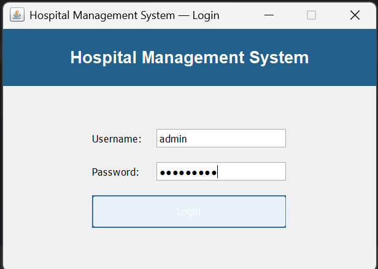
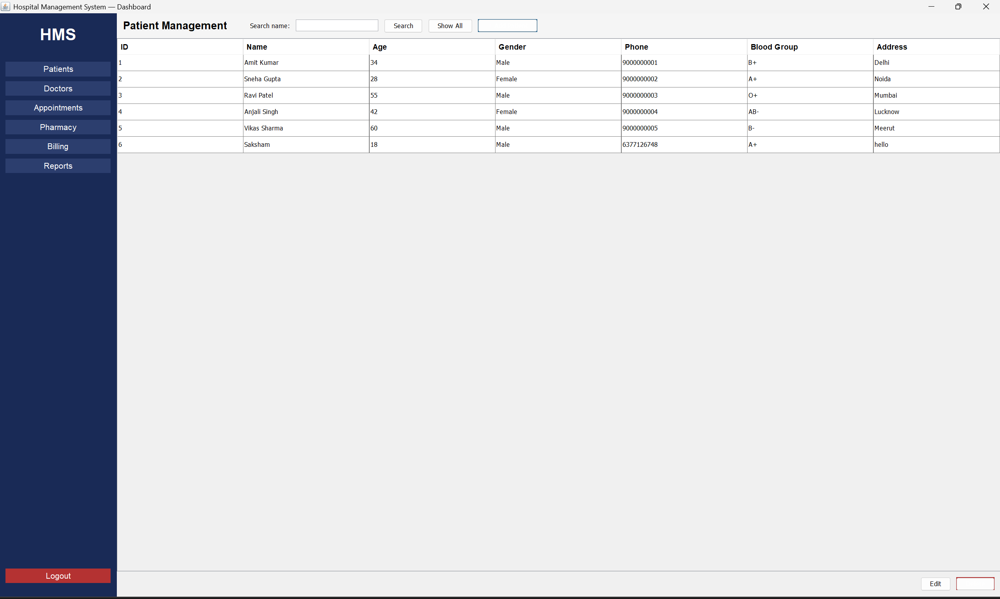
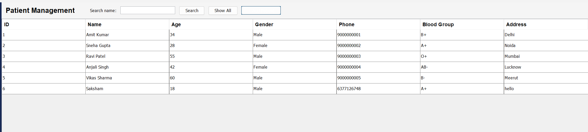
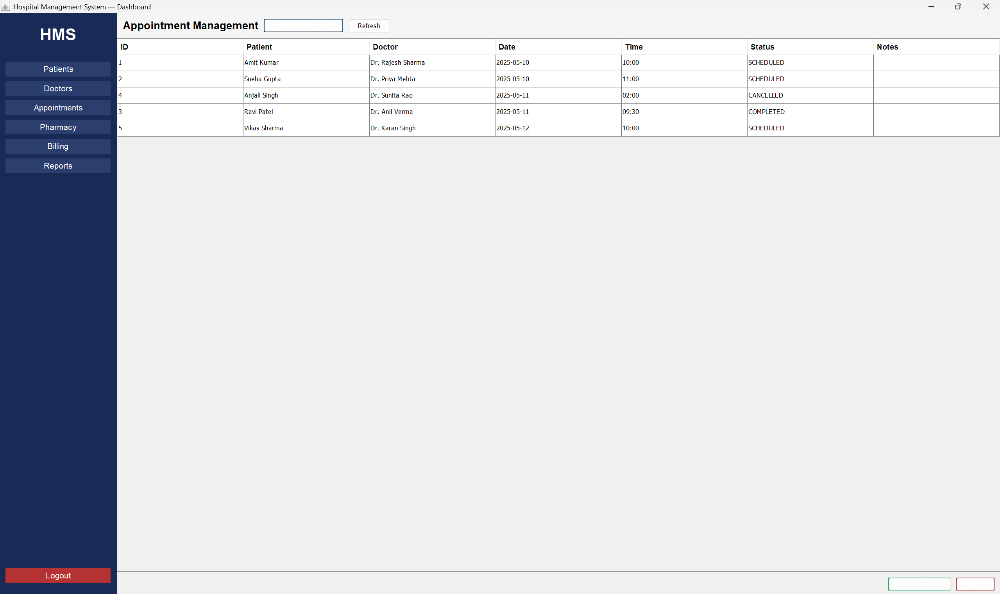
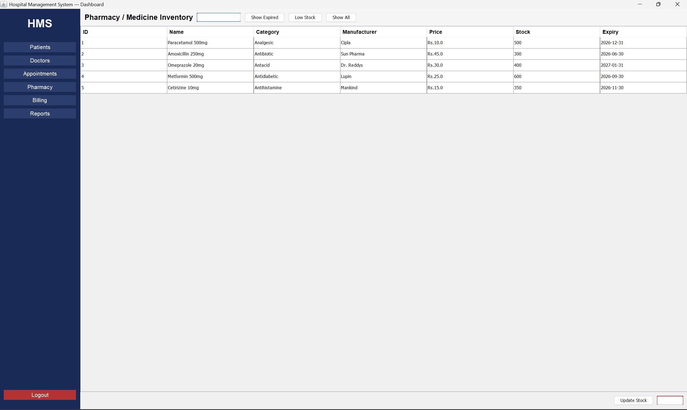
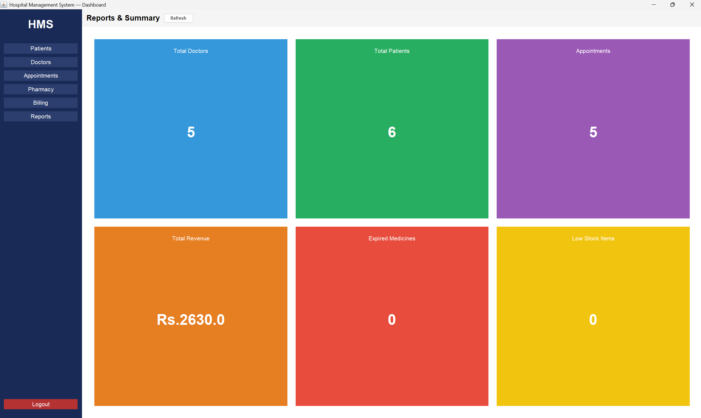

# 🏥 Hospital Management System

> A full-featured desktop application built in Java to manage hospital operations including patients, doctors, appointments, pharmacy, billing, and admin reporting.


 
---

## 📋 Table of Contents

- [Overview](#overview)
- [Features](#features)
- [Tech Stack](#tech-stack)
- [Project Structure](#project-structure)
- [Architecture](#architecture)
- [Database Schema](#database-schema)
- [Getting Started](#getting-started)
    - [Prerequisites](#prerequisites)
    - [Run from JAR](#run-from-jar)
    - [Run from Source (IntelliJ)](#run-from-source-intellij)
    - [Run from Source (Eclipse)](#run-from-source-eclipse)
- [Default Login](#default-login)
- [Screenshots](#screenshots)
- [Java Concepts Covered](#java-concepts-covered)
- [Team](#team)
---

## Overview

The **Hospital Management System (HMS)** is a Java Swing desktop application developed as a B.Tech CSE Capstone project at UPES (Batch 27, Semester IV). It provides a centralized system to manage all core hospital operations through a clean, role-based GUI.

The database is hosted on **Railway cloud**, so the application works from any machine with Java installed — no local MySQL setup required.
 
---

## Features

### 👤 Patient Management
- Register new patients with blood group and address
- Search patients by name
- Edit and delete patient records
- View complete patient list in a sortable table
### 🩺 Doctor Management
- Add doctor profiles with specialization, qualification, and consultation fee
- Search doctors by specialization
- Delete doctor records
### 📅 Appointment Booking
- Book appointments with conflict detection (double-booking prevented at Java + DB level)
- Mark appointments as Completed or Cancelled
- View all appointments with patient and doctor names (via JOIN)
- Custom `AppointmentConflictException` shown as user-friendly warning
### 💊 Pharmacy / Medicine Inventory
- Add and manage medicines with expiry dates
- Expired medicines highlighted in **red** automatically
- Filter by Expired or Low Stock (< 20 units)
- Update stock quantities
### 🧾 Billing
- Generate bills linked to patient and appointment
- Auto-calculates total (consultation fee + medicine charge)
- Mark bills as Paid
- Live total revenue counter
### 📊 Admin Reports
- Dashboard with 6 live stat cards:
    - Total Doctors, Total Patients, Total Appointments
    - Total Revenue, Expired Medicines, Low Stock Items
---

## Tech Stack

| Component | Technology |
|-----------|-----------|
| Language | Java 17+ |
| UI Framework | Java Swing (javax.swing) |
| Database | MySQL 8.x |
| DB Hosting | Railway.app (cloud) |
| DB Connectivity | JDBC (MySQL Connector/J 8.x) |
| IDE | IntelliJ IDEA / Eclipse |
| Version Control | Git + GitHub |
| Distribution | Runnable JAR |
 
---

## Project Structure

```
src/
└── hms/
    ├── models/
    │   ├── Person.java              # Abstract base class
    │   ├── Doctor.java              # Extends Person, implements Schedulable
    │   ├── Patient.java             # Extends Person
    │   ├── Appointment.java         # With Status enum
    │   ├── Medicine.java            # With isExpired(), isLowStock()
    │   ├── Bill.java                # With PaymentStatus enum
    │   └── Admin.java
    │
    ├── interfaces/
    │   └── Schedulable.java         # isAvailable(), addSchedule(), etc.
    │
    ├── exceptions/
    │   ├── AppointmentConflictException.java
    │   ├── DoctorNotFoundException.java
    │   ├── PatientNotFoundException.java
    │   └── MedicineNotFoundException.java
    │
    ├── dao/
    │   ├── DBConnection.java        # Singleton JDBC connection
    │   ├── DoctorDAO.java
    │   ├── PatientDAO.java
    │   ├── AppointmentDAO.java
    │   ├── MedicineDAO.java
    │   ├── BillDAO.java
    │   └── AdminDAO.java
    │
    ├── services/
    │   ├── DoctorService.java
    │   ├── PatientService.java
    │   ├── AppointmentService.java  # Conflict detection logic
    │   ├── MedicineService.java     # Stream-based filtering
    │   ├── BillService.java         # Revenue calculation
    │   └── AdminService.java
    │
    ├── ui/
    │   ├── LoginFrame.java
    │   ├── DashboardFrame.java      # CardLayout with sidebar
    │   ├── PatientPanel.java
    │   ├── DoctorPanel.java
    │   ├── AppointmentPanel.java
    │   ├── MedicinePanel.java
    │   ├── BillingPanel.java
    │   └── ReportsPanel.java
    │
    └── Main.java                    # Entry point
```
 
---

## Architecture

The project follows a clean **4-layer architecture**:

```
┌─────────────────────────────────┐
│         UI Layer (Swing)        │  ← hms.ui
│  LoginFrame, DashboardFrame,    │
│  PatientPanel, DoctorPanel ...  │
└────────────────┬────────────────┘
                 │ calls
┌────────────────▼────────────────┐
│       Service Layer             │  ← hms.services
│  Validation, business logic,    │
│  exception throwing             │
└────────────────┬────────────────┘
                 │ calls
┌────────────────▼────────────────┐
│         DAO Layer               │  ← hms.dao
│  All SQL queries via JDBC       │
│  PreparedStatements only        │
└────────────────┬────────────────┘
                 │ reads/writes
┌────────────────▼────────────────┐
│       MySQL Database            │
│  Railway cloud / local          │
└─────────────────────────────────┘
```

**Rule:** UI → Service → DAO → Database. No layer skips another.

### OOP Hierarchy

```
Person (abstract)
├── Doctor (implements Schedulable)
└── Patient
 
Schedulable (interface)
└── isAvailable(), addSchedule(), removeSchedule(), getSchedule()
 
Custom Exceptions (extend RuntimeException)
├── AppointmentConflictException
├── DoctorNotFoundException
├── PatientNotFoundException
└── MedicineNotFoundException
```
 
---

## Database Schema

```sql
CREATE DATABASE hospital_db;
```

### Tables

| Table | Primary Key | Foreign Keys | Notes |
|-------|------------|--------------|-------|
| `doctors` | `doctor_id` | — | UNIQUE on phone, email |
| `patients` | `patient_id` | — | UNIQUE on phone |
| `appointments` | `appointment_id` | `patient_id`, `doctor_id` | UNIQUE on (doctor_id, date, time) |
| `medicines` | `medicine_id` | — | — |
| `bills` | `bill_id` | `patient_id`, `appointment_id` | — |
| `admin` | `admin_id` | — | UNIQUE on username |

> **Double-booking prevention:** The `UNIQUE KEY (doctor_id, appointment_date, appointment_time)` on the appointments table ensures no two bookings can exist for the same doctor at the same time — enforced at both the Java service layer and the database level.
 
---

## Getting Started

### Prerequisites

- Java 17 or higher — [Download from Adoptium](https://adoptium.net)
- Internet connection (for Railway cloud database)
---

### Run from JAR

This is the easiest way — no IDE or MySQL setup required.

**1. Download the JAR**

Download `HospitalManagementSystem.jar` from the [Releases](../../releases) page.

**2. Run it**

```bash
java -jar HospitalManagementSystem.jar
```

Or simply **double-click** the JAR file on Windows (Java must be installed).
 
---

### Run from Source (IntelliJ)

**1. Clone the repository**

```bash
git clone https://github.com/saksham1895garg/HospitalManagementSystem.git
cd HospitalManagementSystem
```

**2. Open in IntelliJ IDEA**

`File → Open → select the project folder`

**3. Add MySQL Connector JAR**

`File → Project Structure → Libraries → + → Java → select mysql-connector-j-8.x.x.jar`

Download connector from: https://dev.mysql.com/downloads/connector/j/

**4. Update database credentials**

Open `src/hms/dao/DBConnection.java` and update:

```java
private static final String URL      = "jdbc:mysql://YOUR_HOST:PORT/hospital_db?useSSL=false&allowPublicKeyRetrieval=true";
private static final String USER     = "root";
private static final String PASSWORD = "YOUR_PASSWORD";
```

**5. Set up the database**

Run the SQL schema file `hospital_db.sql` in MySQL Workbench or the Railway console.

**6. Run**

Right-click `Main.java` → `Run 'Main.main()'`
 
---

### Run from Source (Eclipse)

**1. Import the project**

`File → Import → Existing Projects into Workspace → Browse to project folder → Finish`

**2. Set Java version**

`Right-click project → Properties → Java Compiler → set to 17`

**3. Mark src as source folder**

`Right-click src → Build Path → Use as Source Folder`

**4. Add MySQL Connector JAR**

`Right-click project → Build Path → Configure Build Path → Libraries → Add External JARs → select mysql-connector-j-8.x.x.jar`

**5. Fix text blocks (if Eclipse shows errors)**

Replace any `"""..."""` text blocks in `AppointmentDAO.java` and `BillDAO.java` with regular string concatenation using `+`.

**6. Update credentials and Run**

Same as IntelliJ steps 4–6 above.
 
---

## Default Login

| Field | Value |
|-------|-------|
| Username | `admin` |
| Password | `admin123` |

> Change this in the `admin` table after first login.
 
---

## Screenshots

### Login


### Dashboard


### Patient Panel


### Appointment Booking


### Pharmacy


### Reports

---

## Java Concepts Covered

| Concept | Where Used |
|---------|-----------|
| Abstract classes | `Person.java` — cannot be instantiated directly |
| Inheritance | `Doctor`, `Patient` both extend `Person` |
| Interfaces | `Schedulable` implemented by `Doctor` |
| Encapsulation | All model fields private with getters/setters |
| Custom Exceptions | `AppointmentConflictException`, `DoctorNotFoundException`, etc. |
| JDBC | All DAO classes — PreparedStatements throughout |
| Collections Framework | `ArrayList`, `List` in all DAO and Service classes |
| Java Streams | `MedicineService` — filter expired/low-stock; `BillService` — revenue sum |
| Enumerations | `Appointment.Status`, `Bill.PaymentStatus` |
| Swing GUI | All `ui/` classes — JFrame, JPanel, JTable, CardLayout, JOptionPane |
| Singleton Pattern | `DBConnection.java` — single shared connection instance |
| DAO Pattern | Separate DAO class per entity for database operations |
| Service Layer Pattern | Business logic separated from UI and database code |
 
---

## Team

| Member          | Sap Id    | Role | Modules |
|-----------------|-----------|------|---------|
| Avishi Mehrotra | 590014422 | Developer | Patient Management + Medical Records |
| Varista Gupta   | 590013578 | Developer | Doctor Management + Appointments |
| Bhoomi Arora    | 590015099 | Developer | Pharmacy + Billing |
| Saksham Garg    | 590014997 | Developer | Admin + Dashboard + Reports |

**Institution:** University of Petroleum & Energy Studies (UPES)  
**Program:** B.Tech Computer Science Engineering  
**Batch:** 27 | **Semester:** IV | **Year:** 2025
 
---

## Acknowledgements

- [Oracle Java Documentation](https://docs.oracle.com/en/java/)
- [MySQL Connector/J Documentation](https://dev.mysql.com/doc/connector-j/)
- [Railway Cloud Platform](https://railway.app)
- [IntelliJ IDEA](https://www.jetbrains.com/idea/)